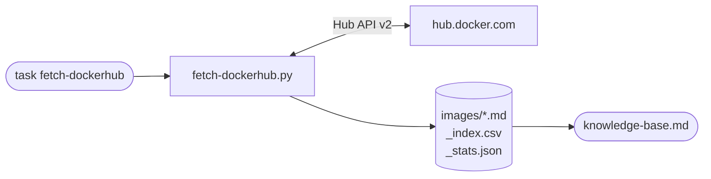

# Docker Hub — Images @rastadidi

Images Docker publiées sur Docker Hub par `rastadidi`.

```sh
task fetch-dockerhub
```


```mermaid
flowchart LR
    T([task fetch-dockerhub]) --> P[fetch-dockerhub.py]
    P <-->|Hub API v2| A[hub.docker.com]
    P --> F[(images/*.md\n_index.csv\n_stats.json)]
    F --> KB([knowledge-base.md])
```
