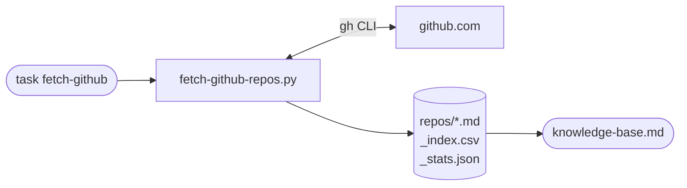

# GitHub — Repos publics @adriens

Repos publics non-forks de `adriens`.

```sh
task fetch-github
```


```mermaid
flowchart LR
    T([task fetch-github]) --> P[fetch-github-repos.py]
    P <-->|gh CLI| A[github.com]
    P --> F[(repos/*.md\n_index.csv\n_stats.json)]
    F --> KB([knowledge-base.md])
```
