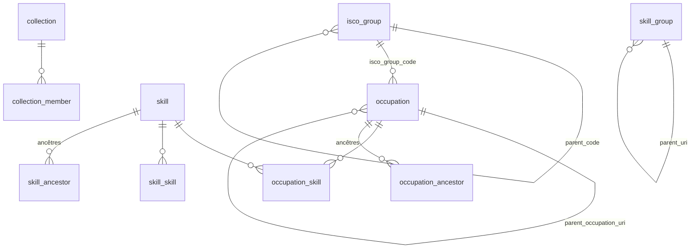

# esco — le référentiel ESCO en base DuckDB

Transforme l'export CSV officiel [ESCO](https://esco.ec.europa.eu/fr) (classification européenne
des professions et compétences) en une base **DuckDB propre, typée et contrainte**, reconstructible
en une commande.

Finalité : disposer d'un socle fiable pour enrichir les contenus produits du dépôt
[`opt-nc/odata-avps`](https://github.com/opt-nc/odata-avps) — les Avis de Vacance de Poste de
l'OPT-NC — dans le cadre du hackathon
[HackAVP](https://dev.to/adriens/hackavp-premier-hackathon-dedie-a-lemploi-dans-la-fonction-publique-en-ncl-3oj0).
La base est pensée pour être ensuite chargée dans BigQuery ou exposée via une API.

> **Périmètre actuel** : ESCO seul. Le rapprochement AVP ↔ ESCO n'est pas encore implémenté.

---

## 🚀 Démarrage

```bash
task          # décompresse l'archive, charge, contrôle, résume
```

Prérequis : [`duckdb`](https://duckdb.org) et [`task`](https://taskfile.dev) dans le `PATH`
(`brew install duckdb go-task`), plus l'archive source à la racine du dépôt :

> **ESCO dataset - v1.2.1 - classification - fr - csv.zip**
> à télécharger sur <https://esco.ec.europa.eu/fr/use-esco/download>
> (`classification` + langue `fr` + format `csv`)

Le nom de l'archive n'est pas figé : le Taskfile détecte `ESCO dataset*csv.zip` et en déduit
la version et la langue, qu'il enregistre dans la table `build_info`. Changer de version ou de
langue se résume à déposer la nouvelle archive et relancer `task build`.

### Tâches disponibles

| Tâche | Rôle |
|---|---|
| `task` / `task build` | Recrée entièrement `esco.duckdb` (extraction → chargement → contrôles) |
| `task extract` | Décompresse l'archive dans `data/raw` |
| `task check` | Rejoue les 42 contrôles qualité sur la base existante |
| `task schema` | Affiche colonnes, types et contraintes relationnelles |
| `task info` | Provenance du build et volumétrie de chaque table |
| `task sql -- f.sql` | Exécute un script SQL sur la base |
| `task shell` | Ouvre la console DuckDB |
| `task clean` | Supprime la base générée |
| `task clean:all` | Supprime la base et les CSV extraits (l'archive est conservée) |

`build` est incrémental : il ne refait rien tant que ni les CSV ni le SQL n'ont changé.
Il est aussi intégralement reproductible — la base est supprimée puis reconstruite, sans état résiduel.

> Pour une requête ponctuelle en une ligne, passer directement par la CLI DuckDB —
> `task` ré-échappe les arguments, ce qui casse les guillemets d'une requête inline :
> ```bash
> duckdb esco.duckdb -box -c "SELECT * FROM v_occupation LIMIT 5"
> ```

---

## 🧱 Organisation

```
Taskfile.yml          point d'entrée unique
sql/01_raw.sql        schéma raw — chargement 1:1 des 18 CSV, tout en VARCHAR
sql/02_model.sql      schéma main — tables typées, clés primaires et étrangères, fermetures transitives
sql/03_views.sql      vues dénormalisées prêtes à consommer
sql/04_comments.sql   documentation embarquée — COMMENT ON sur chaque table, colonne et vue
sql/05_checks.sql     42 contrôles qualité — le build échoue si l'un d'eux tombe
model.rdf             ontologie ESCO (OWL), chargée dans model_term
data/raw/*.csv        extraction de l'archive (recréée par task extract)
esco.duckdb           la base, ~109 Mo
```

Le découpage en couches sépare ce qui est **fidèle à la source** (`raw`, jamais modifié,
toujours disponible pour arbitrage) de ce qui est **nettoyé** (`main`). Toute transformation
est donc traçable et rejouable.

---

## 🗂️ Modèle de données



**Deux piliers, chacun avec deux hiérarchies.** Côté professions : le rattachement ISCO *et* une
profession parente (1 248 professions, jusqu'à 3 niveaux). Côté compétences : les groupes K/S/T/L
*et* une compétence parente (6 460 relations, jusqu'à 6 niveaux, plusieurs parents possibles).
Les deux fermetures transitives sont matérialisées (`occupation_ancestor`, `skill_ancestor`) : on
« roule » vers n'importe quel ancêtre par une simple jointure, sans CTE récursive.

Les hiérarchies directes sont de **vraies clés étrangères auto-référentes**
(`isco_group.parent_code`, `skill_group.parent_uri`, `occupation.parent_occupation_uri`) : les
tables sont alimentées niveau par niveau pour que DuckDB puisse les vérifier.

### Tables

| Table | Lignes | Contenu |
|---|---:|---|
| `occupation` | 3 039 | Professions : libellés (dont formes **masculine / féminine** séparées), description, code, profession parente, codes NACE, statut réglementé |
| `skill` | 13 939 | Compétences et connaissances : type, niveau de réutilisation, description, **racines K/S/T/L** et **compétences parentes** dénormalisées |
| `isco_group` | 619 | Groupes CITP/ISCO-08, niveaux 1 à 4, FK `parent_code` |
| `skill_group` | 640 | Groupes de compétences, niveaux 0 à 3, FK `parent_uri`, `root_code`, chemin complet, marqueur `is_isced_f` |
| `occupation_skill` | 126 051 | Compétences `essential` / `optional` par profession |
| `occupation_skill_inherited` | 222 448 | Idem, **plus les compétences héritées des professions ancêtres** (`depth` = 0 pour les propres) |
| `skill_skill` | 5 818 | Relations entre compétences |
| `occupation_broader` | 3 648 | Hiérarchie du pilier professions (relation directe) |
| `occupation_ancestor` | 13 622 | Fermeture transitive : chaque profession vers **tous** ses ancêtres |
| `skill_broader` | 20 819 | Hiérarchie du pilier compétences (relation directe) |
| `skill_ancestor` | 81 992 | Fermeture transitive : chaque compétence vers **tous** ses ancêtres, à leur profondeur minimale |
| `collection` | 7 | Collections thématiques et leur `skos:ConceptScheme` |
| `collection_member` | 2 554 | Appartenance aux collections |
| `concept_label` | 44 786 | **Tous les libellés à plat, sous forme normalisée**, formes genrées séparées, ambiguïté matérialisée (voir plus bas) |
| `green_share` | 3 590 | Part d'activité « verte » par profession et groupe ISCO 3/4 |
| `dictionary` | 153 | Métadonnées ESCO sur chaque champ de l'export |
| `model_term` | 155 | **Ontologie ESCO** (`model.rdf`) : classes, propriétés, individus, avec libellé et définition officiels (voir plus bas) |
| `quality_check` | 42 | Résultat des contrôles du dernier build |
| `build_info` | 1 | Version ESCO, langue, archive source, horodatage |

Collections : `digital`, `dig_comp`, `green`, `language`, `research`, `transversal` (compétences)
et `research_occupation` (professions).

### Vues

| Vue | Usage |
|---|---|
| `v_occupation` | Profession + profession parente + chaîne ISCO complète + effectifs de compétences (propres, optionnelles, **héritées**) + part verte + collections |
| `v_skill` | Compétence + parents + groupes + racines K/S/T/L + collections + **nombre de professions qui la mobilisent** (0 pour les 464 compétences orphelines) |
| `v_isco_group` | Groupe ISCO + chemin complet + effectifs de professions (directes et indirectes) + part verte |
| `v_skill_group` | Groupe de compétences + effectifs (directs et indirects) |
| `v_occupation_skill` | Relation profession ↔ compétence, libellés des deux côtés |
| `v_occupation_skill_inherited` | Idem, compétences héritées comprises, avec la profession source |

### Macros SQL

Persistées dans la base, réutilisables dans toute requête aval :

| Macro | Rôle |
|---|---|
| `normalize_label(s)` | Minuscules, sans accents ni ponctuation — la forme de rapprochement |
| `gender_forms(label)` | `[masculin, féminin]` d'un libellé de profession « a/b », `NULL` sinon |
| `esco_url(uri)` | Lien vers la fiche du concept sur le portail ESCO (`lang := 'en'` pour l'anglais) |
| `concept_id(uri)` | Dernier segment d'une URI ESCO |
| `concept_type_of(t)` | Type ESCO (`KnowledgeSkillCompetence`, `ISCOGroup`…) → type harmonisé (`skill`, `isco_group`…) |
| `split_lines(s)` / `split_uris(s)` / `split_pipe(s)` / `squish(s)` | Découpage des champs multivalués, nettoyage des espaces |
| `xml_text(x, tag)` / `xml_resources(x, tag)` / `xml_unescape(s)` | Extraction par expressions régulières dans `model.rdf` (pas de dépendance XML) |

```sql
SELECT preferred_label, esco_url(uri) FROM occupation WHERE code = '4211.2';
-- https://esco.ec.europa.eu/fr/classification/occupation?uri=http://data.europa.eu/esco/occupation/6a6e174e-...
```

Le chemin `/classification/occupation` du portail est un **résolveur universel** : il rend
aussi bien les professions que les compétences, les groupes ISCO et les groupes ISCED-F.
Ne pas le « corriger » en `/classification/skill` pour les compétences — ce chemin renvoie
une erreur 500 sur une URI de compétence.

---

## 🧹 Ce qui a été nettoyé

Chaque décision ci-dessous a été vérifiée sur les données, pas supposée.

**Doublons de l'export.** Les CSV ESCO contiennent 4 professions et 21 compétences en double,
ne différant que par `modifiedDate` (deux dates d'export pour un contenu identique). Seule la
version la plus récente est conservée, et un contrôle dédié prouve qu'aucune autre colonne ne diffère.

**Colonnes vides ou constantes.** `definition` et `scopeNote` sont **vides à 100 %** sur les
professions et les compétences ; `member-occupations` / `member-skills` couvrent 100 % de leur
pilier. Elles ne sont pas reprises — `raw` les conserve, et un contrôle fera échouer le build si
une future version d'ESCO se met à les renseigner.

**Champs multivalués.** `altLabels`, `hiddenLabels`, `inScheme`, `naceCode` et
`broaderConceptUri` mélangent trois séparateurs selon les fichiers — retour ligne, virgule, pipe.
Tous deviennent des `VARCHAR[]`. Les codes NACE sont réduits à leur code (`7112`, `J`) au lieu de
l'URI complète.

**Libellés en anglais.** Les tables de relations de l'export *français* portent des libellés
en **anglais** (`occupationLabel`, `skillLabel`). Ils sont supprimés : on rejoint par URI, et
les libellés français viennent de `occupation` / `skill`. Idem pour `skillType` porté par les
relations : il duplique `skill.skill_type` (0 divergence, contrôlé).

**Hiérarchie des compétences.** `skillGroups_fr.csv` et `skillsHierarchy_fr.csv` décrivent les
mêmes 640 nœuds — vérifié, correspondance 1:1 sur l'URI et le code. Ils sont fusionnés en une
seule table `skill_group`. La racine **K (connaissances) est en réalité la classification
ISCED-F 2013** : 220 nœuds sur 640 portent une URI `/esco/isced-f/`, signalée par `is_isced_f`.

**Collections ≡ schémas de concepts.** Les 7 fichiers de collections ne sont pas répliqués en
7 tables : seule l'appartenance est conservée dans `collection_member`. Vérifié : les valeurs
discriminantes d'`inScheme` (dont deux UUID opaques) coïncident **exactement** avec les
collections — `inScheme` n'est donc pas repris, et `collection.scheme_uri` en garde la trace.
Le champ `broaderConceptUri` des collections est lui couvert par `skill_ancestor` (contrôlé).

**Types de concepts.** Les tables polymorphes (`*_broader`, `*_ancestor`, `green_share`,
`concept_label`) utilisent toutes le même vocabulaire snake_case :
`occupation | skill | isco_group | skill_group`, au lieu de `KnowledgeSkillCompetence`,
`ISCOGroup`, `ISCO level 3`…

**Types.** Dates ISO 8601 → `TIMESTAMP WITH TIME ZONE`, `greenShare` → `DOUBLE`,
niveaux hiérarchiques → `TINYINT`.

### Formes genrées : **2 314 professions sur 3 039** ont un libellé « masculin/féminin »

`développeur de logiciels/développeuse de logiciels` : un intitulé de poste ne porte **jamais**
les deux formes. Sans traitement, une recherche exacte sur « développeur de logiciels » ne
trouve rien. L'export mélange d'ailleurs deux écritures :

| Écriture | Exemple | Résultat |
|---|---|---|
| Formes complètes | `développeur de logiciels/développeuse de logiciels` | `développeur de logiciels` · `développeuse de logiciels` |
| Forme courte | `vendeur/vendeuse en articles de sport` | `vendeur en articles de sport` · `vendeuse en articles de sport` |

La macro `gender_forms` gère les deux ; `occupation.preferred_label_m` / `_f` portent le résultat,
et `concept_label` reçoit une ligne par forme (`variant` = `full` / `masculine` / `feminine`),
libellés alternatifs compris (`expert RGPD/experte RGPD`). Appliqué **au seul pilier professions** :
dans les compétences, « / » n'est pas un marqueur de genre (`créer un scénario/une bible littéraire`).

> Limite connue : 1 libellé à 4 segments (`formateur «…/…»/formatrice «…/…»`) et 1 forme courte
> irrégulière (`ouvrier brasseur-malteur/ouvrière brasseuse malteuse`) ne sont pas résolus proprement.

### `concept_label` : la table qui change tout

Les 44 786 libellés — préférés, alternatifs, cachés, et leurs formes genrées — des professions,
compétences, groupes ISCO et groupes de compétences sont mis à plat, avec leur forme normalisée
indexée.

C'est le socle du rapprochement avec les intitulés d'AVP, qui ne tombent jamais pile sur
le libellé officiel. Exemple parlant : **« chief data officer » n'est pas un libellé préféré**,
c'est un libellé *alternatif* de `directeur des données/directrice des données`. Chercher
uniquement dans les libellés préférés le rendrait introuvable.

> ⚠️ 737 libellés normalisés sont **ambigus** : ils désignent plusieurs concepts distincts
> (ex. « concepteur de base de données » renvoie à trois professions). Ils sont marqués
> `is_ambiguous = true`, à arbitrer au moment du rapprochement.

### Ce qu'on a appris du référentiel en chemin

- **4 professions ont un code qui ne prolonge pas celui de leur profession parente**
  (`2512.7 ingénieur DevOps cloud` est enfant de `2512.1`, `2421.8` de `2164.4`…). Le code est
  un identifiant, pas une hiérarchie : `parent_occupation_uri` et `occupation_ancestor` font foi.
- **464 compétences ne sont mobilisées par aucune profession** et **10 groupes ISCO de niveau 4
  n'ont aucune profession** — visibles dans `v_skill.n_occupations` et `v_isco_group.n_occupations`.
- Une compétence peut avoir **jusqu'à 8 parents** ; `skill_ancestor` garde chaque ancêtre une
  fois, à sa profondeur minimale.
- **L'héritage n'est pas monotone** : 5 494 compétences sont *optionnelles* chez la profession
  parente mais *essentielles* chez l'enfant. `occupation_skill_inherited` livre les deux lignes
  telles quelles (`relation_type` différent, `source_occupation_uri` différent) — le modèle ne
  tranche pas à la place d'ESCO.

### Documentation embarquée

Chaque table, colonne et vue du schéma `main` porte un `COMMENT ON` (fichier `04_comments.sql`)
qui cite la propriété SKOS / ESCO d'origine et les valeurs admises. La documentation voyage donc
**avec la base** et reste lisible depuis n'importe quel client :

```sql
SELECT column_name, comment
FROM duckdb_columns()
WHERE table_name = 'skill';
-- reuse_level │ esco:skillReuseLevel — transversal | cross-sector | sector-specific | occupation-specific.
```

### L'ontologie ESCO dans la base : `model_term`

L'archive contient `model.rdf`, l'ontologie OWL qui définit le vocabulaire ESCO. Elle est
chargée telle quelle dans `raw.model_rdf` puis analysée en SQL pur (expressions régulières,
aucune dépendance XML) vers `model_term` : **155 termes** — 41 classes, 62 propriétés d'objet,
21 propriétés de données, 10 propriétés d'annotation, 10 individus, 10 types de données — avec
`label`, `definition`, `domains`, `ranges`, `sub_class_of`, `inverse_of`, notes d'historique et
dates. Les textes sont **en anglais** (l'ontologie n'est pas traduite). **109 termes sont
`owl:deprecated`** : le fichier livré documente surtout le modèle v1 pour mémoire.

Utile pour lire une colonne à la source, sans quitter la base :

```sql
SELECT id, label, definition
FROM model_term
WHERE id IN ('relatedEssentialSkill', 'skillReuseLevel');
-- relatedEssentialSkill │ has essential skill      │ The ESCO skill or competence that is essential for the subject occupation or skill.
-- skillReuseLevel       │ skill reuseability level │ Reuseability level of a skill
```

---

## 🔒 Intégrité

La base porte de vraies contraintes, enforcées par DuckDB à l'insertion :

- **15 clés primaires**, dont 9 composites
- **11 clés étrangères**, dont **3 auto-référentes** (`isco_group.parent_code`,
  `skill_group.parent_uri`, `occupation.parent_occupation_uri`) ; les autres :
  `occupation → isco_group`, `occupation_skill → occupation` et `→ skill`, `skill_skill → skill` (×2),
  `occupation_ancestor → occupation`, `skill_ancestor → skill`, `collection_member → collection`
- **28 contraintes `CHECK`** sur les domaines de valeurs : `relation_type` ∈ {essential, optional},
  `skill_type`, `reuse_level`, `status`, `regulation_status`, `variant`, niveaux hiérarchiques,
  `green_share` dans [0,1], types de concepts des tables polymorphes. Elles documentent les valeurs
  admises et font échouer le build si une future version d'ESCO introduit une valeur inconnue —
  plutôt que de la laisser passer en silence.
- **3 contraintes d'unicité**, `NOT NULL` sur tout ce qui est obligatoire

Quatre tables sont **polymorphes** — leurs URI pointent tantôt vers un concept, tantôt vers un
groupe (`occupation_broader`, `skill_broader`, `green_share`, et la cible des `*_ancestor`). Une
clé étrangère unique n'y est pas exprimable ; elles sont couvertes par des contrôles d'intégrité
dédiés dans `05_checks.sql`.

`occupation_skill_inherited` est volontairement **sans PK ni FK** : ses index ART coûteraient
**60 Mo pour 9 Mo de données** (mesuré), alors que son contenu découle intégralement de
`occupation_skill` et `occupation_ancestor`. Unicité du grain et références y sont contrôlées.

Les 42 contrôles couvrent la complétude (rien perdu entre `raw` et `main`), la sûreté du
dédoublonnage et des colonnes écartées, l'intégrité des deux hiérarchies et de leurs fermetures,
l'équivalence collections ≡ schémas, les formes genrées, la cohérence des valeurs et le
chargement complet de l'ontologie.
**Le build échoue si l'un d'eux tombe** — la base n'est jamais livrée en état douteux.

```bash
task check    # rejoue les contrôles et affiche le détail
```

---

## 💡 Exemples

```sql
-- Retrouver un métier par n'importe lequel de ses libellés, formes genrées comprises
SELECT o.preferred_label, o.code, l.label_type, l.variant
FROM concept_label l JOIN occupation o ON o.uri = l.concept_uri
WHERE l.label_normalized = normalize_label('Développeuse de logiciels');
-- → développeur de logiciels/développeuse de logiciels (2512.4) : forme féminine du libellé
--   préféré — ESCO la liste aussi comme libellé alternatif à part entière

-- Libellés alternatifs : « expert RGPD » n'est pas un libellé préféré
SELECT o.preferred_label, l.label
FROM concept_label l JOIN occupation o ON o.uri = l.concept_uri
WHERE l.concept_type = 'occupation' AND l.label_normalized LIKE '%rgpd%' AND NOT l.is_ambiguous;
-- → délégué à la protection des données/déléguée à la protection des données (2619.4)

-- Les compétences essentielles d'un métier
SELECT skill_type, skill_label
FROM v_occupation_skill
WHERE occupation_uri = (SELECT uri FROM occupation WHERE code = '2512.4')
  AND relation_type = 'essential';
-- → développeur de logiciels : 24 compétences essentielles

-- Compétences héritées : une profession très spécialisée est incomplète seule
SELECT depth, source_occupation_label, count(*) AS n
FROM v_occupation_skill_inherited
WHERE occupation_code = '2512.4.1'
GROUP BY ALL ORDER BY depth;
-- → « développeur de chaînes de blocs » : 60 compétences propres (depth 0),
--   108 héritées de « développeur de logiciels » (depth 1)

-- Roll-up : toutes les professions rattachées, même indirectement, à un groupe ISCO
SELECT code, preferred_label, n_occupations, n_direct_occupations
FROM v_isco_group WHERE code IN ('2', '25', '2512');
-- → 868 professions sous le grand groupe 2, 10 sous « Concepteurs de logiciels »

-- Roll-up côté compétences : nature d'une compétence via ses racines
SELECT preferred_label, root_codes, n_occupations
FROM v_skill WHERE preferred_label ILIKE 'python%';
-- → Python (programmation informatique) : [K] = connaissance

-- Remonter la hiérarchie d'une compétence sans CTE récursive
SELECT g.code, g.preferred_label, a.depth
FROM skill_ancestor a JOIN skill_group g ON g.uri = a.ancestor_uri
WHERE a.skill_uri = (SELECT uri FROM skill WHERE preferred_label = 'Python (programmation informatique)')
ORDER BY a.depth;

-- Les métiers les plus « verts » d'un grand groupe ISCO
SELECT preferred_label, green_share
FROM v_occupation
WHERE isco_major_group_code = '2' AND green_share > 0
ORDER BY green_share DESC LIMIT 10;
```

---

## 🔭 Suite

1. Charger les AVPs OPT-NC (JSON-LD `JobPosting` de
   [`opt-nc/odata-avps`](https://github.com/opt-nc/odata-avps), également publiés sur
   [HuggingFace](https://huggingface.co/datasets/opt-nc/odata-avps) et
   [data.gouv.nc](https://data.gouv.nc/explore/dataset/avis-de-vacances-de-poste-avp-drhfpnc)).
2. Rapprocher `relevantOccupation.name`, `skills[]` et
   `educationRequirements.competencyRequired[]` des concepts ESCO via `concept_label`.
3. Exporter le résultat vers BigQuery ou l'exposer en API.

---

## 📄 Licence des données

Le référentiel ESCO est publié par la Commission européenne sous licence
[CC BY 4.0](https://creativecommons.org/licenses/by/4.0/). L'archive source n'est pas redistribuée
ici : elle se télécharge sur le [portail ESCO](https://esco.ec.europa.eu/fr/use-esco/download).