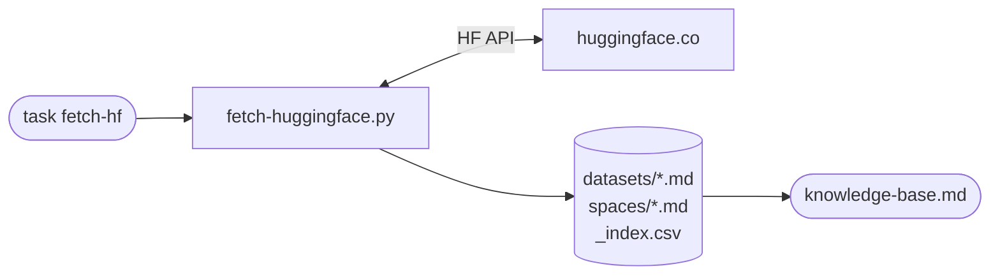

# HuggingFace — Datasets & Spaces @rastadidi

Datasets et Spaces publiés sur HuggingFace par `rastadidi`.

```sh
task fetch-hf
```


```mermaid
flowchart LR
    T([task fetch-hf]) --> P[fetch-huggingface.py]
    P <-->|HF API| A[huggingface.co]
    P --> F[(datasets/*.md\nspaces/*.md\n_index.csv)]
    F --> KB([knowledge-base.md])
```
