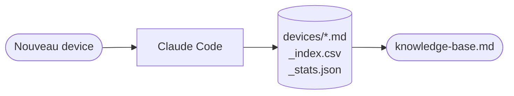

# IoT — Gadgets @adriens

Inventaire des devices IoT/Maker d'Adrien. Pas d'API publique — alimentation **manuelle via Claude Code**.



## Schéma d'un device

```yaml
slug: esp8266-nodemcu-01
name: "ESP8266 NodeMCU"
category: microcontroller   # microcontroller | sbc | gateway | sensor | module | kit
brand: "AI-Thinker"
connectivity: [wifi]        # wifi | lora | zigbee | bluetooth | usb | ethernet
status: active              # active | retired | shelved | planned
acquired: 2021
use_case: "Monitoring température/humidité"
project: ""                 # slug projet associé (optionnel)
tags: [iot, wifi, python]
```
