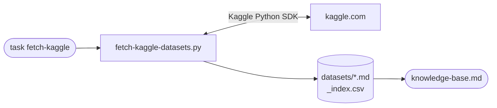

# Kaggle — Datasets @adriensales

Datasets publiés sur Kaggle par `adriensales`.

```sh
task fetch-kaggle
```


```mermaid
flowchart LR
    T([task fetch-kaggle]) --> P[fetch-kaggle-datasets.py]
    P <-->|Kaggle Python SDK| A[kaggle.com]
    P --> F[(datasets/*.md\n_index.csv)]
    F --> KB([knowledge-base.md])
```
