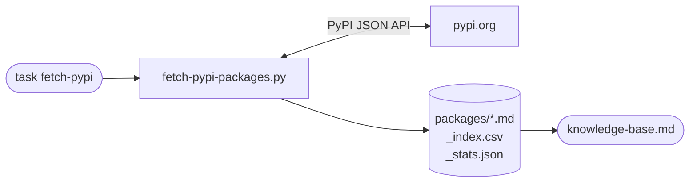

# PyPI — Packages @rastadidi

Packages Python publiés sur PyPI par `rastadidi`.

```sh
task fetch-pypi
```


```mermaid
flowchart LR
    T([task fetch-pypi]) --> P[fetch-pypi-packages.py]
    P <-->|PyPI JSON API| A[pypi.org]
    P --> F[(packages/*.md\n_index.csv\n_stats.json)]
    F --> KB([knowledge-base.md])
```
