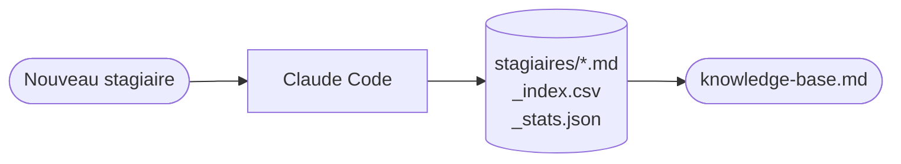

# Stagiaires — Adrien Sales

Inventaire des stagiaires et étudiants en projet tutoré encadrés par Adrien. Alimentation **manuelle via Claude Code**.



## Schéma d'un stagiaire

```yaml
slug: YYYY-prenom-nom
name: "Prénom Nom"
school: "École / Université"
formation: "Diplôme / Programme"
type: stage              # stage | projet-tutore
employer: "OPT-NC"
start: YYYY-MM
end: YYYY-MM
subject: "Sujet du stage ou projet"
current_position: "Poste actuel si connu"
url: ""                  # lien reco ou projet (optionnel)
tags: [tag1, tag2]
```
