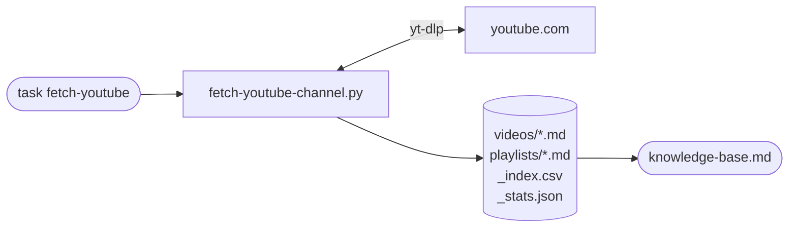

# YouTube — Chaîne devops-lab

Vidéos, playlists et statistiques de la chaîne YouTube `devops-lab`.

```sh
task fetch-youtube          # vidéos + stats
task fetch-youtube-playlists  # playlists uniquement
```


